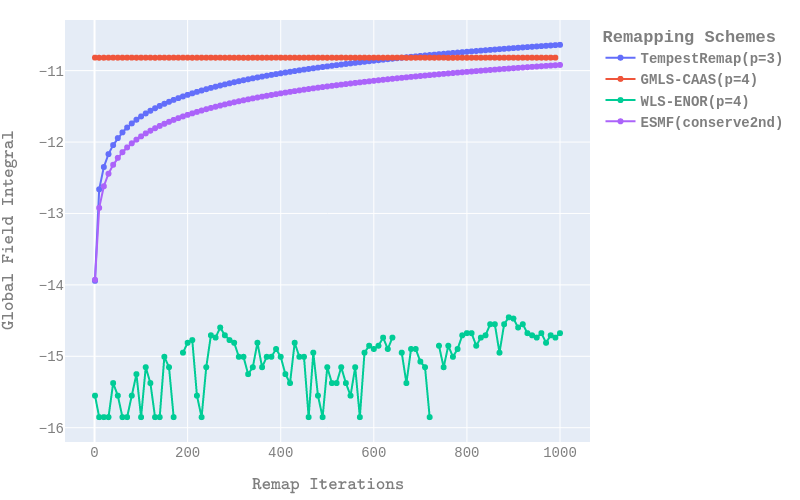
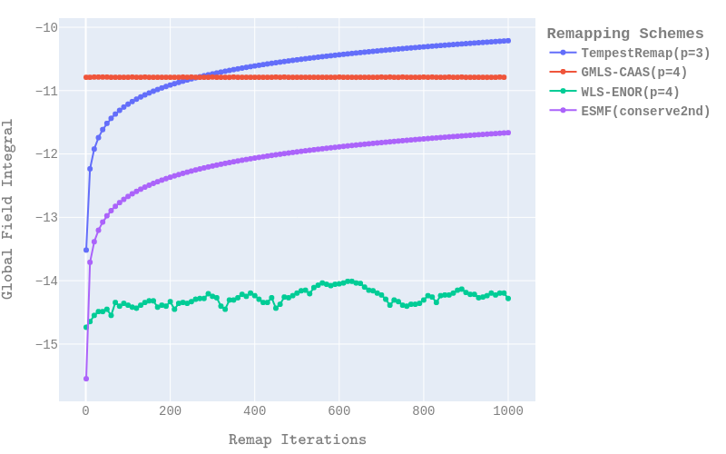
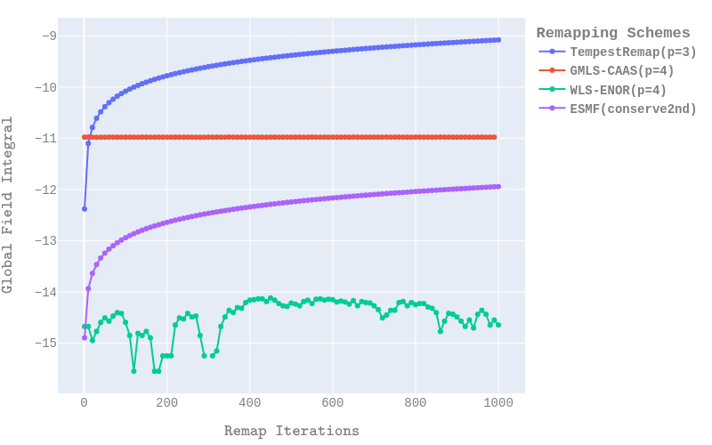

# MIRA-Datasets - Datasets from Metrics for Intercomparison of Remapping Algorithms

The [MIRA](https://github.com/CANGA/MIRA) project provides the Python drivers for the intercomparison study to enable the computation of metrics for different remapping algorithms of interest in ESM.


## Repository Organization

The dataset repository contains three groups of artifacts: the original test cases used in the study and the output metrics data from four different remapping algorithms, along with some helpful scripts to compare the metrics data. Details are provided below.

1) All of the input meshes, sampled reference data on the meshes for several uniformly refined resolutions, and regionally refined cases are contained within the `Meshes` directory. 
    - The uniformly refined meshes for Cubed-Sphere (CS), polygonal quasi-uniform MPAS and Regular Latitude-Longitude (RLL) meshes along with sampled field data for five different fields are provided in `Meshes/UniformlyRefined/` directory.
    - The regionally refined meshes for CS and MPAS meshes around continental-US (CONUS) region with the sampled reference field data is available under `Meshes/RegionallyRefined` directory.

2) The input meshes provided under `Meshes` directory were used to perform a remapping intercomparison study that analyzed the key numerical metrics to gain better insight into the behavior of remapping algorithms, and to compare several key properties under a unified framework. Four different remapping algorithms were considered in this study.

   - Earth System Modeling Framework (ESMF) Regrid
   - TempestRemap high-order conservative maps
   - Generalized Moving-Least-Squares (GMLS) algorithm
     - A variation with the Clip-And-Assured-Sum (CAAS) algorithm to enforce bounds preservation
   - Weighted-Least-Squares Essentially Non-oscillatory Remap (WLS-ENOR) scheme

     The metrics data collected for each of the cases and remapping algorithms are stored under the `MetricsData` directory. The metrics CSV files include details about:
      - Error convergence data in global norms $L_1, L_2, L_{\inf}, H_1$ and $\left|H_1\right|$
      - Global bounds preservation for determining monotonicity
      - Local feature preservation through repeated remapping cycles
      - Grid independence by using test cases with different mesh types and (uniformly refined/regionally refined) resolutions

3) A set of helpful Python scripts have also been provided to easily compare different aspects of the metrics data to gain more insight into the behavior of the remapping algorithms. These are under `Scripts` directory. An example usage to compare the four different algorithms stored in the repository for the GlobalConservation (GC) metric of the 'TotalPrecipWater' field, for three different mesh resolution combinations of CS-MPAS uniformly-refined case is shown below.
```
plot_dataset(ivar=4, metricnames=['GC'], resolutions=[(0, 4), (4, 0), (4, 4)],
                 gridtypes=[0], orders=[4, 4, 4, 2], showPlot=False)
```

<div align="center">
    


**Figure (a): Global Conservation Metric for TotalPrecipWater field on CS(0)-MPAS(4) mesh**



**Figure (b): Global Conservation Metric for TotalPrecipWater field on CS(4)-MPAS(0) mesh**



**Figure (c): Global Conservation Metric for TotalPrecipWater field on CS(4)-MPAS(4) mesh**
    
</div>

## License

The MIRA remapping intercomparison code and the associated datasets provided in this repository are distributed under an open-source licensing agreement. Please refer to the [](LICENSE) for further details on the agreement and copyright information.

## Contributors

- Vijay Mahadevan (Mathematics and Computational Science Division, Argonne National Laboratory, Lemont, IL 60439, USA)
- Jorge Guerra (OU/CIMMS, NOAA National Severe Storms Laboratory, Norman, OK, USA)
- Paul Kuberry (Center for Computing Research, Sandia National Laboratories, Mailstop 1320, P.O. Box 5800, Albuquerque, NM 87125, USA)
- Xiangmin Jiao (Department of Applied Mathematics \& Statistics, Stony Brook University, Stony Brook, NY 11704, USA)


